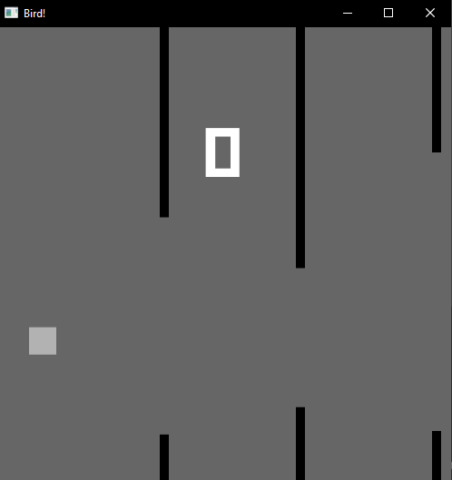

# Flappy bird Bevy

A basic flappy bird written in rust, using the Bevy game engine.



## Build and run

To build this game install rust and cargo and use one of the following commands:

```
# windowed game
cargo run

# web game
cargo run --target wasm32-unknown-unknown
```